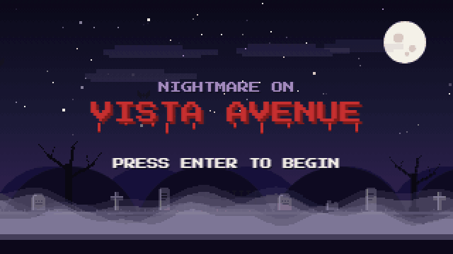

# Nightmare on Vista Avenue

A pixel-art graveyard side-scroller built for my Halloween themed birthday party. Dodge dancing skeletons, spinning pumpkins, flying ghosts and dropping spiders, make it through the castle door, and answer the Keeper's questions. Get the last one wrong and the ghosts win. Get it right and you survive until morning.

**Play it:** https://waterloggedporcupine.github.io/nightmare-on-vista-avenue/



## How it works

- Title screen, then a graveyard menu with rolling fog and a scream that writes itself across the sky every seven seconds.
- Players type their name once; the game remembers it between visits.
- Controls: **Up** jumps, **Right** runs forward, **Left** runs back, **Down** ducks. Phones get on-screen buttons.
- Two levels of increasing difficulty, each ending at a Dracula-castle door.
- Behind each door, a multiple-choice question in a pixel cutscene board.
- Two endings: a swarm of ghosts and a tombstone, or a swarm of ghosts chased off by the sunrise.

## Tech

Vanilla HTML, CSS and JavaScript on a 320x180 canvas scaled up with `image-rendering: pixelated`. No framework, no build step, no image files: every sprite is a small string grid in `js/sprites.js` baked to an offscreen canvas at load, and the larger props (door, moon, tombstones, trees) are drawn with canvas primitives. Sound is a tiny Web Audio synth in `js/audio.js`.

```
index.html          page shell, touch controls, name input
css/style.css
js/config.js        questions, answers, level tuning, lives
js/engine.js        canvas, fixed-step loop, input, scene manager, text/panel helpers
js/sprites.js       pixel art + procedural props
js/background.js    sky, moon, stars, hills, fog, the sky-scream
js/audio.js         synth sound effects
js/scenes/          title, menu, name, instructions, level, question, ending
```

## Run locally

Any static server works. For example:

```
python -m http.server 8080
```

then open http://localhost:8080.

## Customize

Everything party-specific (questions, correct answers, hazard speeds, number of lives, scream text) lives in `js/config.js`.

## Hosting

Served by GitHub Pages from the root of the `main` branch. The project page on [zhurisolan.com](https://zhurisolan.com) embeds it.

It is set up to move to `nightmare.zhurisolan.com`. Once the custom domain is set in the Pages settings, the github.io address redirects there automatically, so existing links and the embed keep working. To switch over, do both steps in the same sitting:

1. In Settings → Pages, set the custom domain to `nightmare.zhurisolan.com`.
2. At the DNS provider for zhurisolan.com, add a `CNAME` record with host `nightmare` pointing to `waterloggedporcupine.github.io`.

Then tick "Enforce HTTPS" once GitHub finishes issuing the certificate.

## License

MIT
